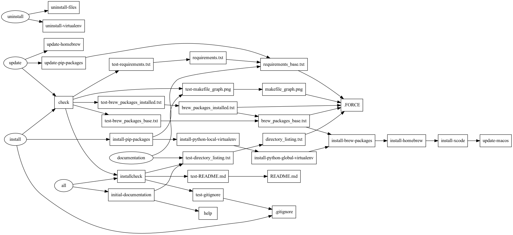

# Makefile for basic system setup
## Brief Description
This project is a [makefile](https://www.gnu.org/software/make/) for macOS systems that installs a python virtual environment using [Homebrew](https://brew.sh) and [pyenv](https://github.com/pyenv/pyenv). It also demonstrates how to organize and document a makefile project. 

This project grew out of the desire to improve the manual process to set up the development environment described in the book [Building Data Products: Data and Analytics Engineering for non-programmers.](https://www.minimumviablearchitecture.com)

**NOTE:** Setting up a Python environment that works today and a year from now can be incredibly frustrating if you are new to Python. I hope this helps.
 
## Project Status
Active
 
## Problem Statement
Reliably setting up and updating the basic software for a project is difficult. Wouldn't it be nice to automate the process so that each new project starts from the same place?

## Who is this for?
In general, this could be used as a start for any Python basic project. Specifically, this is for data analysts who may not have the understanding and sufficient *muscle memory* to setup and update their development and build systems. 
 
## Prerequisites
[ ] MacOS computer
[ ] Admin access to install software.
[ ] Access to the internet.

## Usage
1. Create a directory called /system_setup within your development environment (e.g., ~/documents/GitHub/).
1. Copy the makefile from this repository into that directory.
1. Run `make` to see the tasks in the makefile.

```makefile
all                  Executes the default make task.
check                Executes all test suites.
documentation        Builds the documentation files for the build. (e.g. schema docs, data flow diagrams)
help                 List of all makefile tasks.
install              Run once when setting up a new system.
installcheck         Run the pre-installation test suite.
uninstall            Uninstalls the project files.
update               Updates base software (OS, Homebrew, python, pip)
```
### First time setup
Setup your BASH profiles by following the comments in the makefile. These make all of the magic in `pyenv` work and if there are issues, it's going to be here.

Run: `make install`

This will:
- Update macOS.
- Download and install Homebrew, and install a number of UNIX utilities.
- Download and install a specific version of Python (e.g., 3.10.2) as defined in the makefile and then install as the global `pyenv` version of python. It also configures that version of python in this local directory.
- Downloads and installs a couple `pip` packages to automate the creation of a picture of the pipeline steps.
- Creates some basic documentation of the project.

### Updating the software
Run: `make update`

This will:
- Update macOS.
- Update Homebrew. If the list of applications changes in the `HOMEBREW-PACKAGES` variable, these will be installed.
- Updates the `pip` packages defined in the `requirements_base.txt:` task.
- Updates the documentation of the project.
	
## Images
makefile_pipeline.png:


directory_listing.txt:
```
.
├── README.md
├── brew_packages_base.txt
├── brew_packages_installed.txt
├── directory_listing.txt
├── makefile
├── makefile_graph.png
├── requirements.txt
└── requirements_base.txt

0 directories, 8 files
```
brew_packages_base.txt:
```text
coreutils
zlib
openssl
readline
xz
git
tree
gawk
pyenv
pyenv-virtualenv
makefile2graph
graphviz
```

brew_packages_installed.txt:
```text
aom 3.3.0
aspell 0.60.8
autoconf 2.71
...
xsv 0.13.0
xz 5.2.5
zlib 1.2.11
```

(pip) requirements_base:
```
makefile2dot==1.0.2
pygraphviz==1.9
```

(pip) requirements.txt:
```
graphviz==0.19.1
makefile2dot==1.0.2
pygraphviz==1.9
```

## Support
Open an issue in the GitHub repository.
 
## Roadmap
- Modify the Project Build Tool created in Chapter 3 of [the book](https://www.minimumviablearchitecture.com) to include the ability to manage Brew, Python, and pip. 
- Support Linux builds. Is there an advantage to using Homebrew for Linux?
 
## How you can help
- Open an issue in the GitHub repository.
- Open a PR.
- Contact me to discuss your ideas: brian [at] minimumviablearchitecture.com
 
## License
[MIT](https://choosealicense.com/licenses/mit/)
